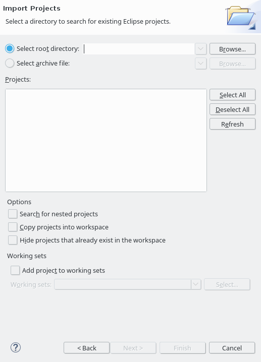

# Overview

This page describes the installation of the following components:

* OMNeT++
* INET
* OMNeT_Utils
* LibPTP
* LibPLN
* PTP_Simulations

After completing this install guide, you should be able to run PTP simulations with LibPTP.

# Install OMNeT++ 4.6

## Installation

The installation of OMNeT++ is described in detail in the official [Install Guide](https://doc.omnetpp.org/omnetpp4/InstallGuide.pdf).
When running OMNeT++ for the first time, you are asked whether you would like to install example projects or the INET framework.
We recommend not to install these projects.

Your OMNeT++ installation should look similar as shown in the following image.
The (empty) *Project Explorer* of OMNeT++ is highlighted in the image.

## Platform recommendations

LibPTP with OMNeT++ 4.6 is known to run well on **Ubuntu 16.04**.
Windows 10 and Ubuntu 18.04 and newer are known to cause problems.
As a result, the recommended platform is still Ubuntu 16.04.

## Getting startet with OMNeT++
Knowledge about OMNeT++ is of great importance when working with LibPTP.
We recommend to read the [OMNeT++ User Guide](https://doc.omnetpp.org/omnetpp4/UserGuide.pdf) before diving into LibPTP.
OMNeT++ also comes with a tutorial for beginners, called *TicToc*, which can be found in the directory *./doc/tictoc-tutorial/index.html* of the OMNeT++ sources.
Completing is tutorial is also highly recommended.

# INET 2.6

#### Step 1: Getting the sources

Download the sources for INET 2.6 from the [INET project](https://github.com/inet-framework/inet/releases/download/v2.6.0/inet-2.6.0-src.tgz).
Extract the archive to a local folder.

#### Step 2: Adding the project to OMNeT++

Right-click in the *Project Explorer* area, and select **Import...**.

Select **General/Existing Projects into Workspace**.

You should see the *Import Projects* popup as shown below.

Select the root directoy by clicking **Browse** and choose the directory where you have extracted the INET source code.
Click **Finish**

The *INET* project should now be shown in your project explorer.

#### Step 3: Building the project

In the project explorer, right-click on the INET project and select **Build Project**.
This will take some time, and as a result you should have a newly compiled library in the folder *out/gcc-debug/src* within the INET project (assuming you have not changed any default settings).

# OMNeT_Utils

#### Step 1: Getting the sources

Get the sources from [Github](https://github.com/ptp-sim/OMNeT_Utils).

#### Step 2: Adding the project to OMNeT++

As for the previous projct, add the project to OMNeT++ via **Import - Existing Projects info Workspace**.

#### Step 3: Building the project

As for the previous projct, build the project via right-click and selecting **Build Project**.
The result of the build process is again a compiled library.

# LibPTP

#### Step 1: Getting the sources

Get the sources from [Github](https://github.com/ptp-sim/libPTP).

#### Step 2: Adding the project to OMNeT++

As for the previous projct, add the project to OMNeT++ via **Import - Existing Projects info Workspace**.

#### Step 3: Building the project

The *LibPTP* project has dependencies on the two previous projects.
You can check that the project references are correctly configured by right-clicking on the LibPTP project and selecting **Properties**.
The projects *INET* and *OMNeT_Utils* should be selected in the **Project References** tab.

As for the previous projct, build the project via right-click and selecting **Build Project**.
The result of the build process is again a compiled library.

# PTP_Simulations

#### Step 1: Getting the sources

Get the sources from [Github](https://github.com/ptp-sim/PTP_Simulations).

#### Step 2: Adding the project to OMNeT++

As for the previous projct, add the project to OMNeT++ via **Import - Existing Projects info Workspace**.

#### Step 3: Building the project

The *PTP_Simulations* project has a dependency on the *libPTP* project.
You can check that the project references are correctly configured again in the **Project References** tab of the projects properties.
The project *libPTP* should be selected.

As for the previous projct, build the project via right-click and selecting **Build Project**.
The result of the build process is an executable.
This is the executable that will carry out your simulations.

#### Step 3: Runnign simulations

When the *PTP_Simulations* has been built successfully, you should be able to carry out simulations.
The *PTP_Simulations* contains example simulations.
As an example, open *simulations/PTP/Mixed_Test_2* in the project explorer.
Right-click on the file **Mixed_Test_2.ned** and select **Run as - OMNeT++ Simulation**.

OMNeT++ might show a popup informing you that a run configuration is created for this simulation.
Select *Do not show this message again* and click **OK**.

**Concratulations!**

You should now see your first PTP simulation!
Have fun exploring PTP!

# LibPLN

#### Step 1: Getting the sources
Get the sources from [Github](https://github.com/ptp-sim/libPLN).

#### Step 2: Building the project
TODO: add detailed instructions

For now, please see the Readme.md file of the [libPLN](https://github.com/ptp-sim/libPLN) project.

