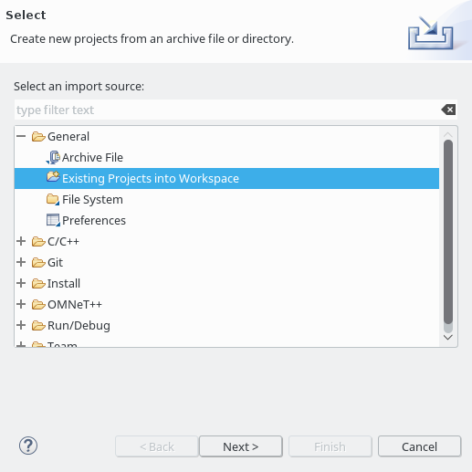
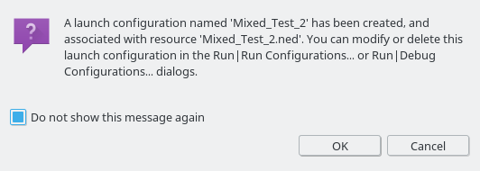
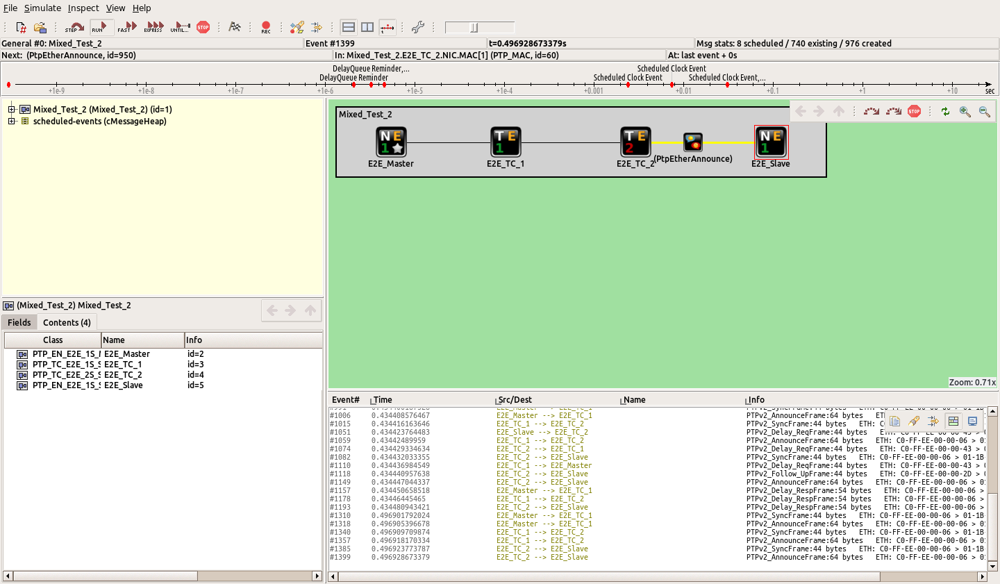

# Overview

This page describes the installation of the following components:

* OMNeT\+\+
* INET
* OMNeT_Utils
* LibPTP
* LibPLN
* PTP_Simulations

After completing this install guide, you should be able to run PTP simulations with LibPTP.

# Install OMNeT\+\+ 4.6

## Installation

The installation of OMNeT\+\+ is described in detail in the official [Install Guide](https://doc.omnetpp.org/omnetpp4/InstallGuide.pdf).
When running OMNeT\+\+ for the first time, you are asked whether you would like to install example projects or the INET framework.
We recommend not to install these projects.

Your OMNeT\+\+ installation should look similar as shown in the following image.
The (empty) *Project Explorer* of OMNeT\+\+ is highlighted in the image.

## Platform recommendations

LibPTP with OMNeT\+\+ 4.6 is known to run well on **Ubuntu 16.04**.
With Ubuntu 18.04 and newer we have experienced problems.
Windows 10 might work, but is not fully tested/supported.

As a result, the recommended platform is still Ubuntu 16.04.
If you would like to help with testing/porting on your favorite platform please contact us in the [discussion forum](http://ptp-sim.boards.net).

## Getting startet with OMNeT\+\+
Knowledge about OMNeT\+\+ is of great importance when working with LibPTP.
We recommend to read the [OMNeT\+\+ User Guide](https://doc.omnetpp.org/omnetpp4/UserGuide.pdf) before diving into LibPTP.
OMNeT\+\+ also comes with a tutorial for beginners, called *TicToc*, which can be found in the directory *./doc/tictoc-tutorial/index.html* of the OMNeT\+\+ sources.
Completing is tutorial is also highly recommended.

# INET 2.6

#### Step 1: Getting the sources

Download the sources for INET 2.6 from the [INET project](https://github.com/inet-framework/inet/releases/download/v2.6.0/inet-2.6.0-src.tgz).
Extract the archive to a local folder.

#### Step 2: Adding the project to OMNeT\+\+

Right-click in the *Project Explorer* area, and select **Import...**.

Select **General/Existing Projects into Workspace**.

You should see the *Import Projects* popup as shown below.

Select the root directoy by clicking **Browse** and choose the directory where you have extracted the INET source code.
Click **Finish**

The *INET* project should now be shown in your project explorer.

#### Step 3: Building the project

In the project explorer, right-click on the INET project and select **Build Project**.
This will take some time, and as a result you should have a newly compiled library in the folder *out/gcc-debug/src* within the INET project (assuming you have not changed any default settings).

# OMNeT_Utils

#### Step 1: Getting the sources

Get the sources from [Github](https://github.com/ptp-sim/OMNeT_Utils).

#### Step 2: Adding the project to OMNeT\+\+

As for the previous projct, add the project to OMNeT\+\+ via **Import - Existing Projects info Workspace**.

#### Step 3: Building the project

As for the previous projct, build the project via right-click and selecting **Build Project**.
The result of the build process is again a compiled library.

# LibPTP

#### Step 1: Getting the sources

Get the sources from [Github](https://github.com/ptp-sim/libPTP).

#### Step 2: Adding the project to OMNeT\+\+

As for the previous projct, add the project to OMNeT\+\+ via **Import - Existing Projects info Workspace**.

#### Step 3: Dependencies

LibPTP depends on the __circular\_buffer__ module of the _boot_ library.
The _circular_buffer_ module is a header-only module, which means consists only of header files and no additional library files need to be linked.

Installation depends on your operating system. Following are instructions for Ubuntu-based Linux systems and Windows.

__Ubuntu:__

On Ubuntu, you can install the complete Boost development files with the following command:
`sudo apt install libboost-dev`

__Windows:__

On Windows, we recommend carrying out the following steps:

* Download the Boost library, unzip it somewhere, e.g. _C:\boost_
* In OMNeT\+\+, open the project settings of LibPTP (right-click -> Project Settings)
* Go to _C/C++ General -> Paths and Symbols_ and switch to the _Includes_ tab
* Add the path where you have installed Boost (e.g. C:\boost)

Additionally, LibPTP has dependencies on the two previous projects (_INET_ and _OMNeT\_Utils_). You can check that the project references are correctly configured by right-clicking on the LibPTP project and selecting **Properties**. The projects *INET* and *OMNeT\_Utils* should be selected in the **Project References** tab.

#### Step 4: Building the project

As with the previous projct, build the project via right-click and selecting **Build Project**.
The result of the build process is again a compiled library.

# PTP_Simulations

#### Step 1: Getting the sources

Get the sources from [Github](https://github.com/ptp-sim/PTP_Simulations).

#### Step 2: Adding the project to OMNeT\+\+

As for the previous projct, add the project to OMNeT\+\+ via **Import - Existing Projects info Workspace**.

#### Step 3: Building the project

The *PTP_Simulations* project has a dependency on the *libPTP* project.
You can check that the project references are correctly configured again in the **Project References** tab of the projects properties.
The project *libPTP* should be selected.

As for the previous projct, build the project via right-click and selecting **Build Project**.
The result of the build process is an executable.
This is the executable that will carry out your simulations.

#### Step 3: Runnign simulations

When the *PTP_Simulations* has been built successfully, you should be able to carry out simulations.
The *PTP_Simulations* contains example simulations.
As an example, open *simulations/PTP/Mixed_Test_2* in the project explorer.
Right-click on the file **Mixed_Test_2.ned** and select **Run as - OMNeT\+\+ Simulation**.

OMNeT\+\+ might show a popup informing you that a run configuration is created for this simulation.
Select *Do not show this message again* and click **OK**.

**Concratulations!**

You should now see your first PTP simulation!
Have fun exploring PTP!

# LibPLN

#### Step 1: Getting the sources
Get the sources from [Github](https://github.com/ptp-sim/libPLN).

#### Step 2: Building the project

Please follow the [_Install Guide_](https://github.com/ptp-sim/libPLN/blob/master/Install_Guide.md) provided by libPLN. After completing this step, you should have two static libraries:

* libPLN.a
* libPLN_Examples.a

#### Step 3: Building libPTP with support for libPLN

* Tell libPTP to actually use libPLN by defining __HAS_LIBPLN__

  * Open the project settings (righ-click on __libPTP -> Project Settings__)
  * Go to __C/C++ General -> Paths and Symbols__
  * Select the __Symbols__ tab
  * Select __GNU C++__ on the left
  * Make sure __Show built-in values__ is not selected (this makes the menu more simple by hiding stuff we don't need)
  * Click on __Add__
  * Set the name to __HAS_LIBPLN__ and the value to __1__
  * Select __Add to all configurations__
  * Click __OK__
  * Keep the project settings open, we also need them in the next step

  Now, when libPTP is compiled, it will find that _HAS_LIBPLN_ is defined und try to use libPLN. This requires that additional header files are available for a successful compilation.

* Add the include paths for libPLN:

  * Stay in the __C/C++ General -> Paths and Symbols__ menu, but change to the __Includes__ tab
  * Select __GNU C++__ on the left
  * Make sure __Show built-in values__ is not selected (this makes the menu more simple by hiding stuff we don't need)
  * Click on __Add__
  * Set the directory to your libPLN installation path, e.g. __`/home/wolfgang/ptp/libPLN`__
  * Select __Add to all configurations__
  * Click __OK__
  * Carry out the same steps again to add the __src__ directory of libPLN as an include path, e.g. __`/home/wolfgang/ptp/libPLN/src`__
  * When you have added, these to include paths, close the project settings again

* Rebuild the libPTP project

  * Right-click on the libPTP project
  * Select __Clean Local__
  * Right-click on the libPTP project
  * Select __Build Project__

#### Step 4: Building PTP_Simulations with support for libPLN

* Add the library path for libPLN to the project

  * Open the project settings (righ-click on __PTP_Simulations -> Project Settings__)
  * Go to __C/C++ General -> Paths and Symbols__
  * Select the __Library Paths__ tab
  * Click __Add__
  * Set the directory to the install path of your compiled libPLN libraries, e.g. __`/home/wolfgang/ptp/libPLN/build/lib/static`__
  * Select __Add to all configurations__
  * Click __OK__
  * Keep the project settings open, we also need them in the next step

* Tell OMNeT\+\+ to link the libraries for libPLN when building the simulation

  OMNeT\+\+ has it's own build system, and for adding the libraries we can't use the usual way it is done in Eclipse (by adding entries in __C/C++ General -> Paths and Symbols -> Libraries__). We have to use __OMNeT\+\+ -> Makemake__ menu:

  * Go to the __OMNeT\+\+ -> Makemake__ menu
  * Select the __src: makemake__ entry
  * Click on __Options__ on the rightside
  * Select the __Link__ tab
  * Click on __More >>__ to show all menu entries
  * Click on the __Add__ buttong (the document with a green plus sign)
  * Enter __fftw3__, click __OK__
  * Carry out this step again, and add __PLN__
  * Carry out this step again, and add __PLN_Examples__
  * You should now have three added libraries:
    * PLN_Examples
    * PLN
    * fftw3
  * Close the _Makemake Options_ menu by clicking __OK__
  * Close the project settings by clicking __OK__

* Rebuild the PTP_Simulations project

  * Right-click on the PTP_Simulations project
  * Select __Clean Local__
  * Right-click on the PTP_Simulations project
  * Select __Build Project__

Your _PTP_Simulations_ project should now be able to carry out simulations where the clock noise is produced by libPLN.
