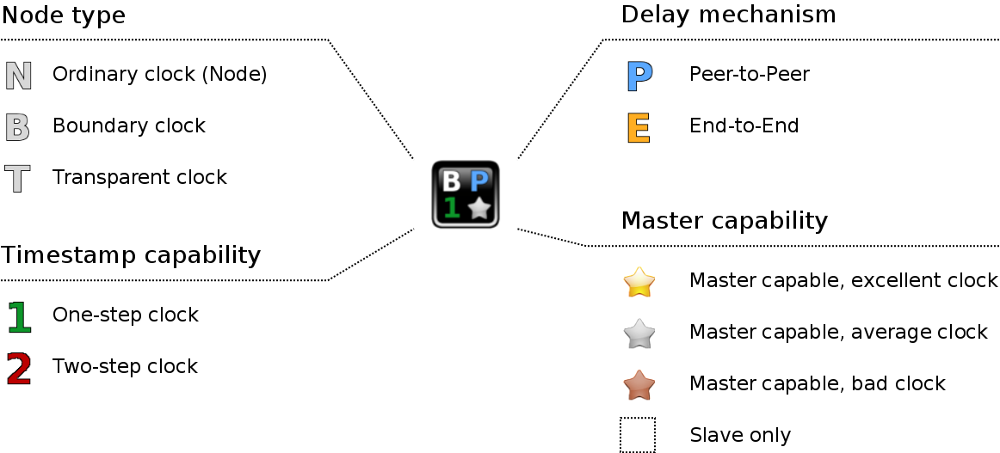
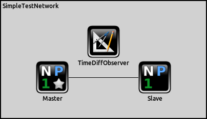
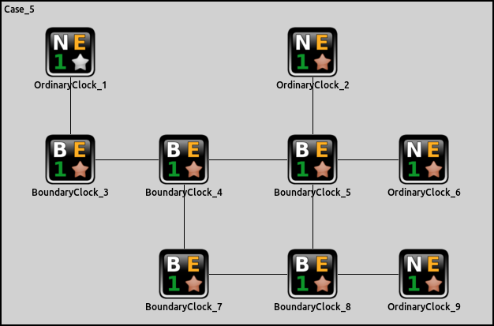
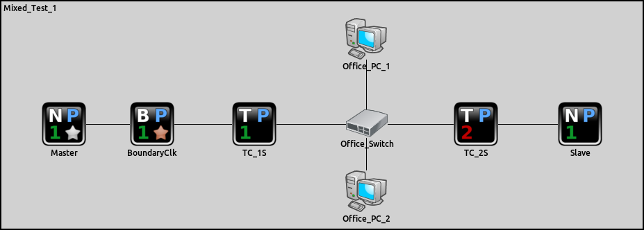
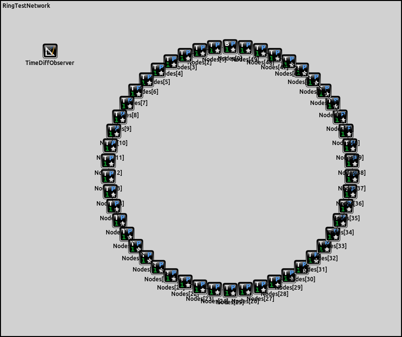
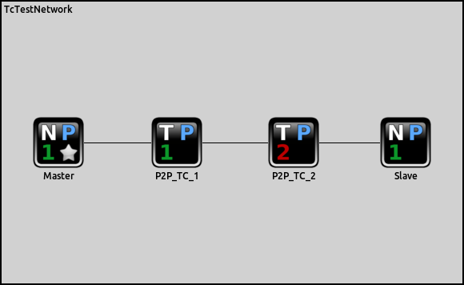
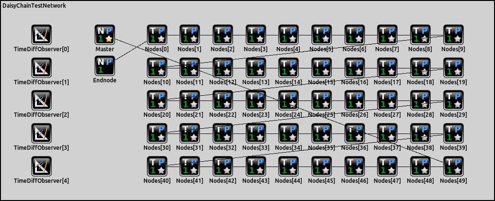

# Under construction
We are still working on the content of this page.

# Introduction

The PTP_Simulations project provides examples PTP networks based on the components provided by libPTP.
This document gives an overview over the available example networks and how they can be used to collect and analyze simulation results.

# Requirements

Please read the OMNeT++ user manual carefully. This description assumes that the reader is familiar with the following topics:

* Network definitions (*.ned files) and their parameters
* Network configuration via *.ini files
* Capturing of simulations results in *.sca and *.vec files
* Analysis of simulation results in OMNeT++ (*.anf files)
* Run configurations in OMNeT++ (based on the concept of run configurations in Eclipse-based IDEs)

Additionally, it is assumed that the reader is aware of the available PTP node types within libPTP.
An overview is given in the image below, a more detailed description can be found in the libPTP readme.

# Simulation types

The example simulations provided by the PTP_Simulations project are contained in the **simulations** folder.
There are two sub-directories:

* PTP
* Testbenches

The folder **Testbenches** contains simple simulations to test individual components of the PTP nodes from libPTP (think of it as very simple unit tests). Their main purpose is testing the libPTP components during development, and so they are only interesting if you are actively developing on libPTP. These examples will not be covered in this description.

The folder **PTP** contains actual examples of PTP networks. They are meant as showcases for what libPTP can do, and are the most interesting to new users. These examples are the topic of this description.

# PTP Simulations

There are several example simulations available, starting with very simple ones and other more specialized ones:

* Single Master
* Simple Network
* BMC Tests
* Mixed Test 1
* Mixed Test 2
* Mixed Test 3
* Ring Test
* Transparent Clock Test
* Daisy Chain Test

These simulations are described below.

## Single Master

This is the most simple test available. It consists of a single PTP node that will eventually become master. The purpose of this network is to serve as a smoke test during development (e.g. if not even this test will run, then something is really wrong).

## Simple Network

This is another simple network, but this one consists of two PTP nodes.
This simple setup already allows to test lots of PTP-related settings.
Additionally it contains a TimeDiffObserver component: this component measures the local times of the Master and Slave nodes as they would be seen by an external observer.

**Remark:** While simple, this is one the most useful simulations for libPTP development and allows to try out many different features by using different configuration files.

## BMC Tests

The Best Master Clock (BMC) algorithm is at the core of the PTP port state machine.
The book *Measurement, Control, and Communication Using IEEE 1588* by John Eidson contains several example networks explaining the BMC algorithm. The example networks given in the book are available as example simulations to test the BMC implementation of libPTP.

**Remark:** The book is about PTPv1, while libPTP implements PTPv2. These versions of PTP use slightly different definitions for the BMC algorithm, which can be observed when running these example simulations (e.g. some details of the results of the example networks won't match the results in the book). Finding and observing these differences is left as an exercise to the reader.

## Mixed Test 1

This is a test network consisting of PTP-aware network nodes and a few non-PTP-aware nodes.
It is well known that traffic bursts in non-PTP equipment can influence the synchronization of PTP nodes negatively, and this can be observed in this example network.

## Mixed Test 2

This is a simple network of PTP nodes using the E2E delay mechanism.

## Mixed Test 3

This is a simple network of PTP nodes using the P2P delay mechanism.

## Ring

An example network for testing the behavior of PTP in rings, and especially the behavior when a connection in a ring breaks.

## Transparent Clock Test

A simple network using transparent clocks.

## Daisy Chain

This is a network to test the influence of the number of nodes in a daisy-chain of PTP nodes.

# Running an example and analyzing results

TODO

