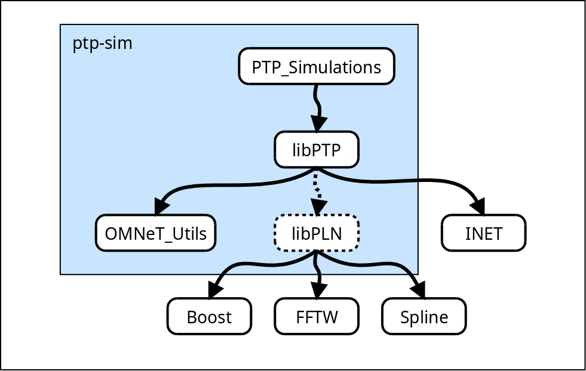

# Simulation of PTP (IEEE 1588)

**ptp-sim** is a community effort to provide a simulation framework for the Precision Time Protocol (PTP) as specified in [IEEE 1588-2008][1].
It is based on [OMNeT++][2] and the [INET Framework][3].

<video src="img/banner/banner.webm" poster="img/banner/banner.png" autoplay loop preload>
</video>

[1]: https://standards.ieee.org/standard/1588-2008.html
[2]: https://omnetpp.org/
[3]: https://inet.omnetpp.org/

## Project overview

The ptp-sim project is the host for the following sub-projects:

* [OMNeT_Utils](https://github.com/ptp-sim/OMNeT_Utils)
* [libPTP](https://github.com/ptp-sim/libPTP)
* [PTP_Simulations](https://github.com/ptp-sim/PTP_Simulations)
* [libPLN](https://github.com/ptp-sim/libPLN)

The relationship between these projects and various other projects is sketched in the following image:

TODO: more detailed description of which role each project plays.

## Further information

* [Install Guide](Install Guide)
* [Usage Examples](Usage Examples)
* [Current State](Usage Examples)
* [Contribute](Contribute)
* [Release Planning](Release Planning)

## Contact

Please visit the [ptp-sim discussion forum](http://ptp-sim.boards.net) for further discussions.
